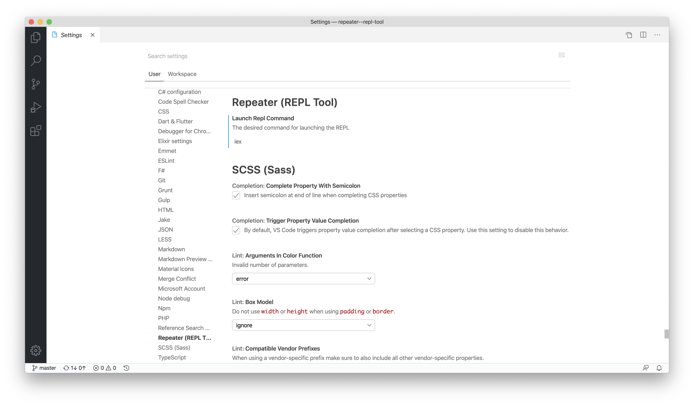

# Repeater (REPL tool)

The object is developing using REPL more fast and with ease. How this extension tries to achieve this is accepting a terminal command for opening whatever REPL you use with the options that you want, then you run the desired code from your file with a shortcut.

## Features

### Use any REPL with any options
Set the terminal command for opening the desired REPL in the VSCode settings.

### Run Code!
Select some code and run by calling vscode command
__Repeater (REPL Tool): Run selected code__. If you need to restart the REPL, call the function __Repeater (REPL Tool): Restart REPL then run selected code__.

#### Shortcuts
__Repeater (REPL Tool): Run selected code__ -> Ctrl+i or Cmd+i
__Repeater (REPL Tool): Restart REPL then run selected code__ -> Shift+Ctrl+i or Shift+Cmd+i

## Requirements
The REPL that you going to use :P
